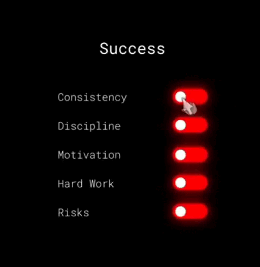

  
  

# 👨🏻‍💻 Java Developer

---

## **🎓 Education**  
Москва - **РТУ МИРЭА** (2023–2027)  
🎯 Прикладная математика и информатика (Системное программирование и компьютерные технологии) - 3 курс  

## **🧑‍💻 Add. education**  

♨️ **ООО "Сенла"**: Java-Intensive; QA internship manual testing

♨️ **T1 Summer Camp 2025**: Java Backend Development

☕ **SwiftBook**: Introduction to Spring

☕ **JavaRush**: Java Core (40 lvl)

📱 **Samsung Innovation Campus**: Kotlin Mobile Development  

🛠️ **Karpov.courses**: Simulator SQL, Docker

---

## Github Stats

